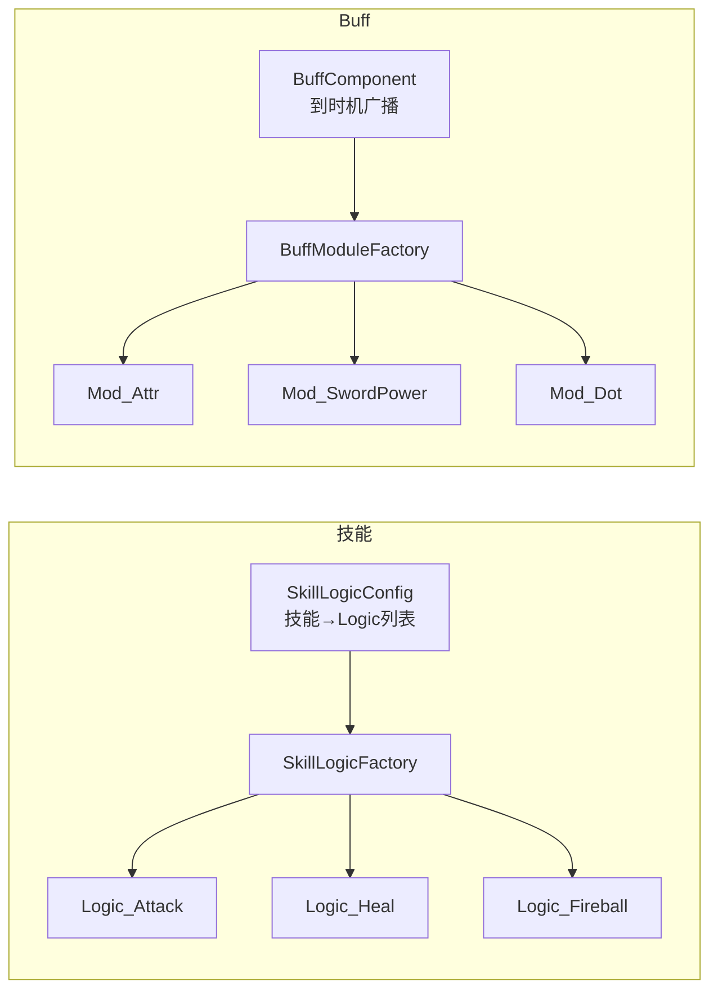
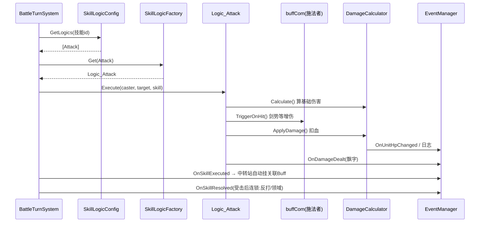
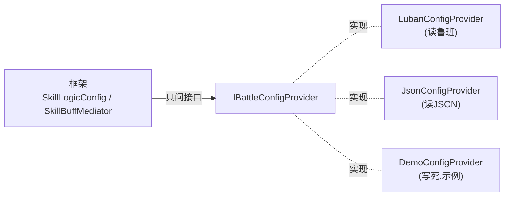

# ⚔️ BattleSys · Unity 战斗框架

> 一套 **数据驱动 · 事件解耦 · 可扩展** 的 Unity 战斗框架。
> **回合制** 与 **ARPG** 两套驱动 **共用同一份** 技能 / Buff / 伤害内核 —— 换玩法不换核心。
> 纯逻辑、零表现耦合(不绑美术 / 动画 / 配表方案),只靠 Console 日志即可完整跑一场战斗。

从一个商业修仙 RPG 项目里抽出的战斗内核,做了彻底解耦,供**学习**与**复用**。

---

## 目录

- [特性](#-特性)
- [架构分层](#-架构分层)
- [核心设计思想](#-核心设计思想)
- [一次出招的完整流程](#-一次出招的完整流程)
- [配表解耦(依赖倒置)](#-配表解耦依赖倒置)
- [回合制 vs ARPG](#-回合制-vs-arpg)
- [目录结构](#-目录结构)
- [依赖](#-依赖)
- [快速开始](#-快速开始)
- [扩展指南](#-扩展指南)
- [Roadmap](#-roadmap)

---

## ✨ 特性

- **双驱动共用核心** — 回合制 `BattleTurnSystem` + ARPG `BattleARPGSystem`,打出的伤害/Buff 完全一致,只是"怎么发动"不同。
- **组件化组合(ECS 思想启发)** — 一个 `BattleUnit` = `attCom`(属性)+ `buffCom`(Buff)+ `skillCom`(技能)拼装,组合优于继承。
- **面向接口 + 工厂** — 技能 `ISkillLogic`、Buff `IBuffModule`,类型 → 工人;加新技能/Buff **只加文件、不改老码**(开闭原则)。
- **事件驱动(发布–订阅)** — 逻辑只发事件,表现层监听;逻辑与 UI/特效彻底解耦。
- **配表解耦(依赖倒置)** — 框架不认识任何配表,数据全走 `IBattleConfigProvider` 接口;数据源(Luban / JSON / SO)由使用者实现。
- **纯逻辑可跑** — 无需 UI/美术,代码造单位 + 假数据源即可跑出完整战斗日志。

---

## 🧱 架构分层

```mermaid
flowchart TB
    subgraph 表现层["表现层（使用者自己接，可选）"]
        UI["UI / 动画 / 特效 / 音效"]
    end
    subgraph 驱动层["驱动层（怎么推进战斗）"]
        TURN["BattleTurnSystem<br/>回合制：按速度轮流"]
        ARPG["BattleARPGSystem<br/>ARPG：前后摇/打断/GCD/连招"]
    end
    subgraph 内核层["内核层（共用，三种玩法都用）"]
        LOGIC["SkillLogic<br/>伤害/治疗/挂Buff"]
        BUFF["Buff 系统<br/>+ Modules"]
        DMG["DamageCalculator<br/>改血唯一咽喉"]
        ATTR["AttributeComponent<br/>属性"]
        MED["SkillBuffMediator<br/>技能↔Buff 中转站"]
    end
    subgraph 数据层["数据层（POCO）"]
        DATA["SkillData / BuffData"]
    end
    PROVIDER["IBattleConfigProvider<br/>（使用者实现：读 Luban/JSON/SO）"]

    UI -. 监听事件 .-> 驱动层
    TURN --> 内核层
    ARPG --> 内核层
    内核层 --> DATA
    DATA -. 由...提供 .-> PROVIDER
```

**两条铁律:**
- 出招只走 `ExecuteSkill`,改血只走 `DamageCalculator`(唯一咽喉,好挂钩子、不会漏)。
- 逻辑不认识具体角色/UI/配表,一律面向 `BattleUnit` + 事件 + 接口。

---

## 🧠 核心设计思想

| 思想 | 体现 |
|---|---|
| 组件化组合(ECS 思想启发) | 单位 = 属性/Buff/技能 组件拼装 |
| 面向接口 + 工厂 | `ISkillLogic` / `IBuffModule`,类型 → 工人 |
| 开闭原则 | 加技能/Buff 只加文件、不改老码 |
| 事件驱动 | `EventManager` 发布–订阅,逻辑 ↔ 表现解耦 |
| 依赖倒置 | 框架定接口,数据源由使用者实现 |
| 数据/行为/驱动 三层分离 | POCO 数据 · 行为模块 · 驱动各自独立 |

### 技能与 Buff:同构的"类型 → 工人"



Buff 按"**触发时机**"拆成一组接口(`IOnHit` / `IOnBehurt` / `IOnTick` / `IOnCasterCast`…);
`BuffComponent` 在对应时机遍历身上的 Buff,`(mod as IOnHit)?.OnHit(...)` —— **实现了该时机的才响应**(多态)。

---

## 🎯 一次出招的完整流程



**关键点**:`Calculate` 只算通用公式(不认识剑势),剑势增伤是 Buff 在 `OnHit` 时改 `DamageInfo.damage` —— **通用计算 + Buff 各自加成** 解耦。

---

## 🔌 配表解耦(依赖倒置)

框架**不读任何配表**,只问接口。数据源由你的游戏实现:



```csharp
// 你的游戏里实现一个 Provider,内部读你的数据源:
public class LubanConfigProvider : IBattleConfigProvider
{
    public SkillData GetSkill(int id) { /* 读鲁班 TBSkill → 填 SkillData */ }
    public BuffData  GetBuff(int id)  { /* 读鲁班 TBBuff  → 填 BuffData  */ }
    public IReadOnlyList<SkillLogicType> GetSkillLogics(int id) { /* 技能→Logic */ }
    public IReadOnlyList<int> GetSkillBuffIds(int id)          { /* 技能→关联buff */ }
}

// 开战前注册一次:
BattleRuntime.Config = new LubanConfigProvider();
```

> 换数据源(Luban / JSON / SO)只写一个新 Provider,**框架一行不改**。

---

## 🔁 回合制 vs ARPG

| | 回合制 `BattleTurnSystem` | ARPG `BattleARPGSystem` |
|---|---|---|
| 推进方式 | 按速度排序,一个个轮流 | 实时,每帧驱动 |
| 出招 | 同步,选技能→选目标→结束回合 | 异步,前摇→主效果→后摇 |
| 特色 | "门"机制等玩家操作 | 打断 / GCD / 连招队列 |
| 主效果 | **都复用 SkillLogic** | **都复用 SkillLogic** |

ARPG 的"打断"靠 `CancellationToken`:`InterruptCurrentSkill()` → 令牌取消 → 正在等待的 `await` 抛异常 → `finally` 清理状态。

---

## 📁 目录结构

```
Assets/
├── BattleCore/            战斗框架本体
│   ├── Common/            枚举:CampType / BattleUnitType
│   ├── Skill/             SkillData / SkillComponent / SkillBuffMediator
│   │   └── Logic/         ISkillLogic + Logic_* + Factory + SkillLogicConfig
│   ├── Buff/              BuffData / BuffComponent
│   │   └── Modules/       IBuffModule + Mod_* + Factory
│   ├── Core/              BattleUnit / AttributeComponent / DamageCalculator
│   ├── Turn/              BattleContext / BattleTurnSystem
│   ├── ARPG/              SkillProcessor + ARPG_* + BattleARPGSystem
│   ├── Config/            IBattleConfigProvider（数据入口抽象）
│   └── Events/            BattleEventDefine
├── EventManager/          通用事件系统（独立库，见依赖）
└── BattleSample/          BattleDemo（回合制/ARPG 一键跑）+ 假数据源
```

---

## 📦 依赖

| 依赖 | 用途 | 说明 |
|---|---|---|
| [UniTask](https://github.com/Cysharp/UniTask) | 异步出招流程 | 已在 `Packages/manifest.json` 以 git 方式引入 |
| [EventListeningSystem](https://github.com/djr666666/EventListeningSystem) | 事件系统 | 本仓库 `Assets/EventManager` 内含一份 |

> Unity 2021+ / URP。装了 Git 才能自动拉 UniTask;没有就去 UniTask Release 下 `.unitypackage` 手动导入。

---

## 🚀 快速开始

### 最快:跑 Demo
打开工程 → 新建空场景 → 空物体挂 `BattleDemo` → Inspector 选 **Mode(Turn / ARPG)** → **Play**,看 Console。

<details>
<summary>ARPG 模式会打出的日志(点开)</summary>

```
======== ARPG 演示开始 ========
—— 场景1:正常释放主动技能(前摇→命中→后摇)——
[ARPG] ▶ 开始释放【疾风斩】
[战斗] 飞月【疾风斩】前摇…
[战斗] 飞月 对 吞天狼 造成 72 伤害
[战斗] 飞月【疾风斩】命中 吞天狼
[战斗] 飞月【疾风斩】后摇…
[ARPG] ■ 释放结束【疾风斩】 success=True
—— 场景2:释放引导技能,中途被打断 ——
[战斗] 飞月【风刃引导】开始引导…
[ARPG] ✖ 被打断【风刃引导】
—— 场景3:GCD期间连按两次(第二次应进队列)——
  第一次=Success   第二次=Queued
======== ARPG 演示结束 ========
```
</details>

### 回合制
```csharp
var mediator = new SkillBuffMediator(); mediator.Init();   // 技能自动挂buff
var units = /* 造若干 BattleUnit:设 attCom 数值 + skillCom.AddSkill */;
var turn = new BattleTurnSystem();
turn.StartBattleInit(units, new BattleContext(), new SkillLogicConfig());
// 监听 BattleEventDefine.OnBattleLog / OnUnitHpChanged / OnBattleEnd 做表现
```

### ARPG
```csharp
var arpg = new BattleARPGSystem();
arpg.Initialize(caster, new SkillLogicConfig());
// 每帧: arpg.Update(Time.deltaTime);
arpg.TryCastSkill(skillId, target);   // 释放
arpg.InterruptCurrentSkill();         // 打断
```

---

## 🧩 扩展指南

### 加一个新技能效果(3 步,不改老码)
1. `SkillLogicType` 加枚举值;
2. 写一个类实现 `ISkillLogic`(照 `Logic_Attack`);
3. `SkillLogicFactory` 注册一行 `{ 类型, new Logic_Xxx() }`。

### 加一个新 Buff(3 步)
1. `BuffType` 加枚举值;
2. 写一个 `Mod_Xxx` 实现它关心的时机接口(`IOnHit` / `IOnTick`…);
3. `BuffModuleFactory` 注册一行。

> 口诀:**改数值 → 用 `AttrMod` + `AttrModType`(不建模块);新机制 → 加 `BuffType` + 模块。**

---

## 🗺 Roadmap

- [x] 回合制驱动
- [x] ARPG 驱动(前后摇 / 打断 / GCD / 连招队列)
- [x] Buff 系统(属性修改 / 剑势叠层 / 持续伤害 / 净化)
- [x] 技能↔Buff 中转站、配表接口解耦
- [ ] 更多 Buff 模块(护盾 / 眩晕 / 反弹 / 吸血…)
- [ ] 战棋(SRPG)驱动:格子 + 寻路 + 按距离选目标
- [ ] 打包成 UPM 包 + 可视化技能编辑器

---

## 📄 License

[MIT](LICENSE)
